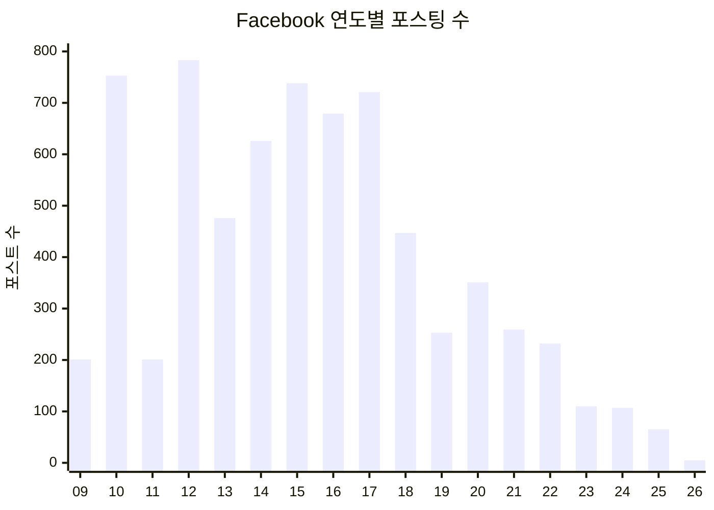

# Facebook 분석보고서 — Peterbook

- 분석일: 2026-03-15
- 분석: 코스모공 (질서력 담당)
- 계정: mice3nyc
- 백업일: 2026-03-02
- 계정 생성일: **2008-02-14** (밸런타인데이!)

---

## 개요

| 항목 | 수치 |
|---|---:|
| 총 포스트 | **7,007** |
| 총 친구 | 1,374 |
| 총 리액션 (준 것) | 24,326 |
| 총 댓글 (쓴 것) | 4,381 |
| 메신저 스레드 | 799 |
| 팔로잉 | 987 |
| 광고 관심사 카테고리 | 660 |
| 검색 기록 | 261 |
| Off-Meta 추적 사이트 | 114 |
| 활동 기간 | **2008~2026 (18년)** |

---

## 포스팅 패턴

### 연도별 포스팅 수

| 시기 | 포스트 수 | 해석 |
|---|---:|---|
| 2009~2012 | 1,938 | **초기 활발기** — 특히 2010(753), 2012(783) 폭발 |
| 2013~2017 | 3,240 | **전성기** — 5년간 연 500~740건. 가장 활발 |
| 2018~2020 | 1,051 | **전환기** — 점차 감소, 2019 최저 253건 |
| 2021~2026 | 778 | **후기** — 인스타로 이동, 페북 활동 급감 |

**최고 활발 연도**: 2012년 (783건)
**최근 5년 급감**: 2017년 721건 → 2025년 65건 (91% 감소)

### 요일별 패턴

| 요일 | 포스트 수 | 비율 |
|---|---:|---|
| **토요일** | 1,187 | **17.0%** ← 가장 활발 |
| 일요일 | 1,075 | 15.3% |
| 금요일 | 1,041 | 14.9% |
| 수요일 | 1,011 | 14.4% |
| 화요일 | 936 | 13.4% |
| 목요일 | 930 | 13.3% |
| **월요일** | 827 | **11.8%** ← 가장 적음 |

**패턴**: 주말형 포스터. 토~일 합계 32.3%. 월요일이 가장 적다.

### 시간대별 패턴

| 시간대 | 포스트 수 | 해석 |
|---|---:|---|
| 07~09시 | **1,344** | 아침 골든타임 (전체의 19.2%) |
| 11~14시 | **1,521** | 점심~오후 (21.7%) |
| 19~21시 | **1,186** | 저녁 시간 (16.9%) |
| 00~01시 | **332** | 야행성 포스팅 (4.7%) |

**피터공은 아침형 포스터**. 오전 8~9시가 피크. 저녁에도 활발하지만 아침이 압도적.

### 미디어 유형

| 유형 | 수 | 비율 |
|---|---:|---:|
| 텍스트만 | 3,686 | 52.6% |
| 사진 | 3,179 | 45.4% |
| 영상 | 142 | 2.0% |

**절반 이상이 텍스트 포스트** — 생각과 글을 중시하는 사용 패턴

---

## 메시지/소통 패턴

### 메신저 TOP 20

| 순위 | 대화방 | 메시지 수 | 성격 |
|---:|---|---:|---|
| 1 | **Second Brain chat play** | **70,788** | 그룹 — 압도적 1위 |
| 2 | protoroom x nolgong | 6,492 | 그룹 — 프로토룸 |
| 3 | MySpace | 3,814 | 그룹 |
| 4 | AI리더십 개발실 | 2,464 | 그룹 — AI |
| 5 | Michael Shilman | 1,596 | 개인 |
| 6 | Jae Ok Lee | 1,246 | 개인 |
| 7 | Jake Jonghwa Kim | 1,186 | 개인 |
| 8 | Kiheon Shin | 1,018 | 개인 |
| 9 | Facebook user | 995 | 개인 (삭제된 계정) |
| 10 | Jiin Ahn | 873 | 개인 |

**인사이트**:
- **Second Brain chat play**가 전체 메시지의 압도적 비중 — 이 그룹이 피터공의 핵심 소통 공간
- 그룹 대화방이 TOP 4 중 3개 — **커뮤니티 중심 소통 스타일**
- 799개 스레드 = 매우 넓은 소통 네트워크
- 개인 대화 1위는 Michael Shilman (1,596건)

### 총 799개 스레드의 의미

- 활동 기간 18년 기준, 연평균 **44명의 새 대화 상대**
- 개인 + 그룹 합쳐 방대한 관계 네트워크

---

## 리액션 패턴

| 리액션 | 수 | 비율 |
|---|---:|---:|
| 👍 좋아요 | 24,312 | **99.94%** |
| 😢 슬퍼요 | 7 | 0.03% |
| ❤️ 사랑해요 | 4 | 0.02% |
| 😮 놀라워요 | 2 | 0.01% |
| 😂 웃겨요 | 1 | 0.00% |

**거의 100% 좋아요만 사용** — 감정 표현에 있어 미니멀리스트. 리액션을 다양하게 쓰지 않고, "좋아요" 하나로 모든 공감을 표현한다.

---

## Facebook이 보는 나 — 광고 데이터 프로필

Facebook이 피터공에게 부여한 **660개 관심사 카테고리** 중 핵심:

### 정체성 태그
| 카테고리 | 해석 |
|---|---|
| Birthday in February | 2월생 |
| Parents with adult children (18-26) | 성인 자녀가 있는 부모 |
| Frequent international travelers | 잦은 해외 여행자 |
| Friends of those who live abroad | 해외 거주 친구 多 |
| Business page admins | 비즈니스 페이지 운영자 |
| Console gamers | 콘솔 게이머 |
| Education and Libraries | 교육 분야 관심 |
| Engaged Shoppers | 적극적 쇼핑 |

### Facebook이 그리는 피터공 프로필
> **2월생, 성인 자녀를 둔 부모이자 국제 여행을 즐기는 게이머. 교육 분야에 관심이 있고, 비즈니스 페이지를 운영하며, 해외에 사는 친구가 많다. Apple 기기를 사용하고 WiFi 환경에서 접속한다.**

---

## 포스트 키워드 분석

### 한국어 주요 키워드 (텍스트 포스트에서 추출)

| 키워드 | 빈도 | 맥락 |
|---|---:|---|
| 있다 | 210 | |
| 내가 | 204 | 1인칭 성찰적 글쓰기 |
| 함께 | 198 | **함께하는 것의 가치** |
| 정말 | 182 | 감탄/강조 |
| 있는 | 175 | |
| 오늘 | 168 | 일상 기록 |
| **아침** | **168** | **아침 시간의 중요성** |
| 좋다 | 166 | 긍정적 톤 |

### 영어 키워드
- **instagram** (296) — 인스타 연동 포스팅이 많았음
- **yfrog** (245) — 초기 이미지 공유 서비스 사용 (2010년대 초)

### 키워드에서 보이는 성격
- "내가", "오늘", "아침" — **일기형 포스터**, 개인적 성찰을 공유
- "함께", "좋다" — **긍정적 톤**, 사람들과의 연결을 중시
- "정말" — 감정을 강하게 표현하는 스타일

---

## 검색 기록 분석

### 가장 많이 검색한 대상

| 검색어 | 횟수 | 유형 |
|---|---:|---|
| **Peter Lee** | 32 | 본인 또는 동명이인 |
| Seung Joon Choi (최승준) | 18+7 | 사람 |
| Sumin Lim | 4 | 사람 |
| The New York Times | 4 | 미디어 |
| Yoonmi Eom | 4 | 사람 |
| 생명다양성재단 | 4 | 단체 |
| 이정모 | 3 | 사람 |
| Yann LeCun | 3 | AI 연구자 |

**검색 성격**: 주로 **사람 검색** — 특정인의 프로필을 찾아보는 용도. Yann LeCun 검색은 AI 관심사를 반영.

---

## Off-Meta 활동 (외부 사이트 추적)

Facebook이 추적하는 외부 활동 114개 사이트:

| 카테고리 | 사이트 |
|---|---|
| **뉴스/미디어** | The New York Times, The Washington Post, The Economist |
| **IT/AI** | Adobe, mit.edu, claude.ai, Anthropic |
| **쇼핑** | Gmarket, 교보문고, book21, 무신사, 올바른간장게장연구소 |
| **여행** | Agoda |
| **보드게임** | koreaboardgames.com |
| **교육** | mit.edu |

**인사이트**: 영어권 프리미엄 미디어(NYT, WaPo, Economist) 구독자. AI 분야(claude.ai, Anthropic, MIT) 관심. 한국 온라인 쇼핑도 활발.

---

## 자기 회고 인사이트

### 1. 18년간의 디지털 인생 기록
- 2008년 밸런타인데이에 가입, 7,007개의 포스트로 삶을 기록
- 2012~2017 전성기에서 점차 인스타로 이동

### 2. 아침형 + 주말형 + 텍스트 중심
- 오전 8~9시가 포스팅 피크 — 아침 루틴으로 글쓰기
- 주말에 더 활발 — 여유로운 시간에 성찰하고 공유
- 52.6%가 순수 텍스트 — 사진보다 **생각과 글**을 더 많이 올림

### 3. 커뮤니티 빌더
- Second Brain chat play 7만건은 단순 대화가 아니라 **지적 커뮤니티 운영**
- protoroom, AI리더십 개발실 등 그룹 기반 소통
- 799개 스레드 = 폭넓은 인적 네트워크

### 4. 리액션 미니멀리스트
- 24,326개 리액션 중 99.94%가 좋아요
- 다양한 감정 표현보다 심플한 "인정" 스타일

### 5. 뉴욕-서울 이중언어 지식인
- 영어/한국어 혼용 포스팅
- NYT, Economist 등 영어권 미디어 + 한국 서비스 동시 사용
- 해외 여행 잦고 해외 거주 친구가 많음
- 게임 + 교육 + AI가 교차하는 독특한 관심사 조합

### 6. 진화의 궤적
- 초기(2009~12): 활발한 일상 공유, yfrog 이미지 서비스 사용
- 전성기(2013~17): 텍스트 중심 성찰, Instagram 연동 시작
- 전환기(2018~20): 활동 감소, 플랫폼 이동 조짐
- 현재(2021~): 페북은 메신저 중심, 포스팅은 인스타로 완전 이동

---

## 요약

| 질문 | 답 |
|---|---|
| 언제 포스팅하나? | 아침 8~9시, 주말 |
| 뭘 올리나? | 텍스트 성찰 (52.6%) > 사진 (45.4%) |
| 누구와 소통하나? | Second Brain 커뮤니티 (7만건), 넓은 네트워크 (799 스레드) |
| 어떤 사람인가? | 아침형, 커뮤니티 빌더, 이중언어, 게임×교육×AI |
| 어떻게 변했나? | 2012 전성기 → 2017 이후 인스타 이동 → 현재 메신저 중심 |
