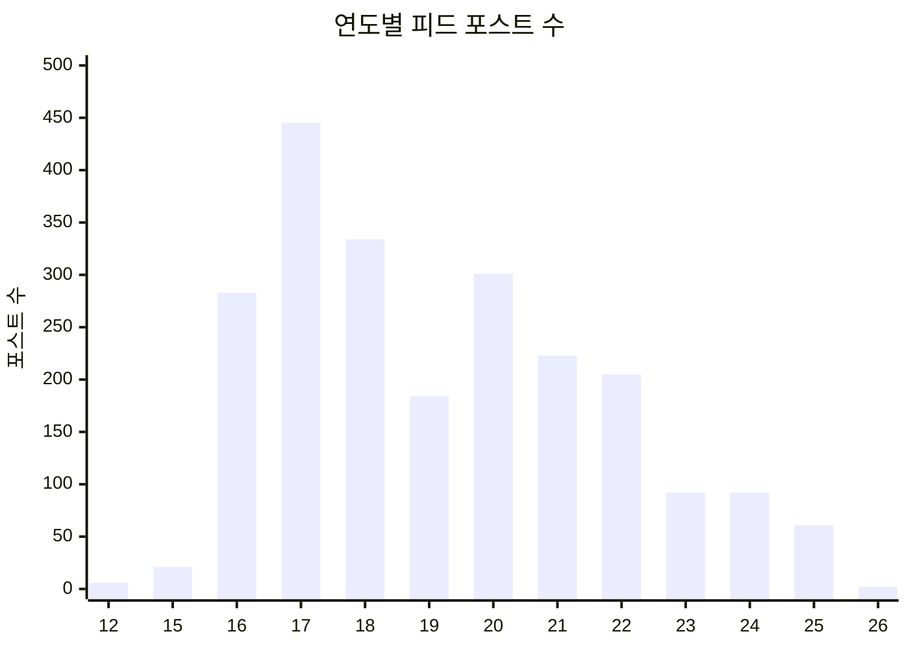
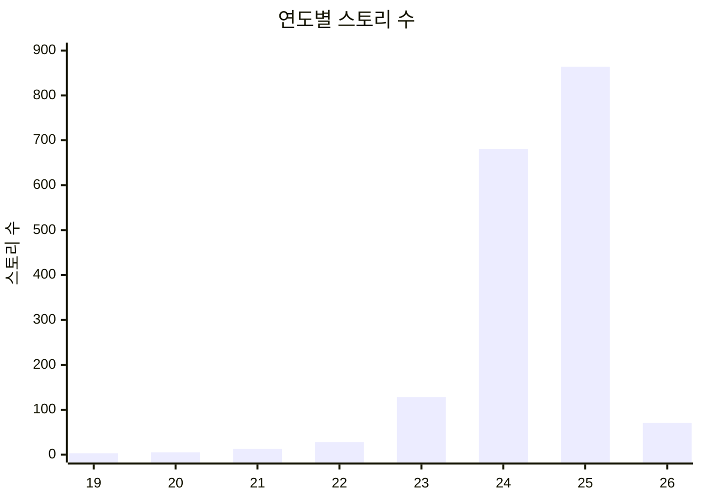

# Instagram 분석보고서 -- peter_nolgong

- 분석일: 2026-03-15
- 백업일: 2026-03-02
- 분석: 코스모공 (Claude)
- 데이터 기간: 2012 ~ 2026년 2월

---

## 1. 개요

peter_nolgong 계정은 2012년부터 약 14년간 운영된 Instagram 계정이다. 게임 디자이너이자 교육자인 피터공의 일상, 사유, 여행, 예술 감상, 그리고 놀공(NOLGONG) 활동이 담겨 있다.

### 전체 현황

| 항목 | 수치 |
|------|------|
| 피드 포스트 | 2,249건 |
| 스토리 | 1,793건 |
| 릴스 | 2건 |
| IGTV | 11건 |
| 아카이브된 포스트 | 1건 |
| 좋아요 누른 게시물 | 73,992건 |
| 좋아요 누른 댓글 | 164건 |
| 남긴 댓글 | 496건 |
| 팔로워 | 1,097명 |
| 팔로잉 | 823명 |
| 친한 친구 | 9명 |
| DM 대화 | 370개 |
| 메시지 요청 | 127개 |

---

## 2. 포스팅 패턴

### 2.1 연도별 피드 포스트

| 연도 | 포스트 | 비고 |
|------|--------|------|
| 2012 | 6 | 시작 |
| 2015 | 21 | 재개 |
| 2016 | 283 | 급증 |
| **2017** | **445** | **최고조** |
| 2018 | 334 | |
| 2019 | 184 | 감소 시작 |
| 2020 | 301 | 팬데믹 반등 |
| 2021 | 223 | |
| 2022 | 205 | |
| 2023 | 92 | 스토리 전환 시작 |
| 2024 | 92 | |
| 2025 | 61 | 에세이형 전환 |
| 2026 | 2 | (2개월) |

### 2.2 연도별 스토리

| 연도 | 스토리 | 비고 |
|------|--------|------|
| 2019 | 3 | 시작 |
| 2020 | 5 | |
| 2021 | 13 | |
| 2022 | 28 | |
| 2023 | 128 | 본격화 |
| 2024 | 681 | 급증 |
| **2025** | **864** | **최고조** |
| 2026 | 71 | (2개월, 연환산 ~426) |

### 2.3 피드 vs 스토리 전환

피터공의 Instagram 사용 패턴에서 가장 두드러진 변화는 **피드 포스트에서 스토리로의 완전한 전환**이다.

- 2017년: 피드 445건 / 스토리 0건
- 2023년: 피드 92건 / 스토리 128건 (교차점)
- 2025년: 피드 61건 / 스토리 864건 (14:1 비율)

이 전환은 단순히 양적 변화가 아니다. 피드 포스트의 성격이 변했다. 초기(2016-2017)에는 일상 스냅샷과 짧은 감상이 주를 이뤘다면, 최근(2025-2026)의 피드 포스트는 AI와 교육, 예술 감상, 사회적 성찰 등에 대한 **긴 에세이형 글**로 변모했다. 일상 기록은 스토리로, 깊은 사유는 피드로 -- 매체 특성에 맞는 자연스러운 분화가 일어났다.

---

## 3. 소통 패턴

### 3.1 좋아요 행동

- 총 73,992건의 좋아요 -- 14년간 평균 **하루 약 14.5건**
- 이는 매우 적극적인 콘텐츠 소비 패턴을 보여준다
- 피드를 열심히 스크롤하며 다른 사람들의 게시물에 반응하는 스타일

### 3.2 댓글 행동

- 남긴 댓글 496건, 좋아요 대비 **0.67%**
- 보는 것은 좋아하지만 말은 아끼는 스타일
- "관찰자이자 감상자" 성격이 드러남

### 3.3 DM / 1:1 소통

- 370개의 DM 대화, 127개의 메시지 요청
- 공개 댓글보다 **1:1 소통을 선호**하는 패턴

### 3.4 팔로워/팔로잉 비율

- 팔로워 1,097 / 팔로잉 823 = 비율 1.33
- 균형 잡힌 비율. 인플루언서 지향이 아닌 **상호적 관계 중심**의 네트워크
- 친한 친구 9명 -- 매우 소수의 친밀한 서클

---

## 4. 관심사 / 주제 분석

### 4.1 해시태그 TOP 27

| 순위 | 해시태그 | 횟수 | 카테고리 |
|------|----------|------|----------|
| 1 | #일링일링 | 233 | 일상 기록 |
| 2 | #주말 | 96 | 일상/시간 |
| 3 | #아침 | 91 | 일상/시간 |
| 4 | #출장 | 76 | 여행/업무 |
| 5 | #책 | 72 | 취미/지적활동 |
| 6 | #모밀이 | 67 | 반려묘 |
| 7 | #고양이 | 53 | 반려묘 |
| 8 | #berlin | 52 | 여행/도시 |
| 9 | #놀공 | 47 | 업무/정체성 |
| 10 | #출근길 | 42 | 일상 |
| 11 | #nolgong | 40 | 업무/정체성 |
| 12 | #그림책 | 38 | 취미/책 |
| 13 | #베를린 | 36 | 여행/도시 |
| 14 | #여름 | 33 | 계절 |
| 15 | #문구덕후 | 33 | 취미/아날로그 |
| 16 | #봄 | 29 | 계절 |
| 17 | #출근 | 28 | 일상 |
| 18 | #미술관 | 28 | 예술 |
| 19 | #책덕후 | 27 | 취미/지적활동 |
| 20 | #서울 | 27 | 도시 |
| 21 | #산책 | 26 | 일상/활동 |
| 22 | #가을 | 26 | 계절 |
| 23 | #기억 | 25 | 감성/성찰 |
| 24 | #커피 | 24 | 일상/취향 |
| 25 | #주말아침 | 24 | 일상/시간 |
| 26 | #부산 | 24 | 여행/도시 |
| 27 | #만화책 | 24 | 취미/책 |

### 4.2 주제별 클러스터

**일상 기록** (가장 큰 클러스터)
- 일링일링(233), 주말(96), 아침(91), 출근길(42), 출근(28), 커피(24), 주말아침(24), 산책(26), 점심(16)
- 일상의 반복되는 순간들을 기록하는 것이 가장 큰 활용 목적

**책/아날로그 문화**
- 책(72), 그림책(38), 문구덕후(33), 책덕후(27), 만화책(24), 땡스북스(21)
- 종이책, 그림책, 만화책, 문구 등 아날로그 매체에 대한 깊은 애정

**반려동물**
- 모밀이(67), 고양이(53)
- 반려묘 '모밀이'에 대한 꾸준한 기록

**여행/도시**
- berlin(52), 베를린(36), 서울(27), 부산(24), 출장(76)
- 베를린이 압도적. 서울과 부산이 뒤따름

**업무/놀공**
- 놀공(47), nolgong(40), NOLGONG(19), BeingFaust(18), goetheinstitut(17)

**예술/미술**
- 미술관(28), 기억(25), 추억(18)

**계절/자연**
- 여름(33), 봄(29), 가을(26), 비(21)

### 4.3 언어 패턴

캡션에서 한국어와 영어가 혼재된다. 일상 기록은 한국어, 국제 교류나 해외 경험은 영어로 작성하는 경향이 있다. 최근 에세이형 포스트는 한국어 중심이지만 영어 인용이나 개념어가 자연스럽게 섞인다.

---

## 5. 자기 회고 인사이트

### 5.1 피터공은 어떤 사람인가

Instagram 데이터가 그려내는 피터공의 인물상:

**사유하는 게임 디자이너**
- 놀공(NOLGONG) 대표로서 게임 디자인과 경험 디자인을 교차시키는 사람
- Eric Zimmerman, Jesper 등 세계적 게임 디자이너들과 오랜 우정
- NYU Game Center, 홍익대 등에서 교육. 학생들과의 1:1 대화를 소중히 함
- Games for Change, Being Faust 등 사회적 의미를 추구하는 프로젝트

**미술관을 사랑하는 감상자**
- Whitney, Guggenheim, Stadel Museum, 국립현대미술관 등 꾸준한 미술관 방문
- "읽을 수 없는 작품을 좋아하지 않는다" -- 명확한 미적 기준을 가진 감상자
- Christine Sun Kim, Marina Zurkow, Carl Schuch 등 아티스트에 대한 깊은 감상문
- 개념미술에 대한 비판적 시각, 그러나 열린 자세

**베를린을 사랑하는 여행자**
- 해시태그에서 berlin/베를린이 총 88회로 가장 많이 등장하는 도시
- "내가 좋아하는 이 도시. 이제 다시 자주 오자"
- 뉴욕과 서울을 오가며, 군산/부산 등 한국 지방도시에도 관심

**에세이스트이자 철학적 질문자**
- AI와 인간의 관계, 효율성의 역설, 교육의 본질 등 깊은 주제의 에세이
- "모르는 채로도 옳은 방향으로 나아갈 수 있는 최소한의 지식" (MVK)
- "사람의 자리는 비효율에 있다"
- "교육은 결과가 아니라 과정의 마찰 속에 있다"

**아날로그와 디지털 사이의 사람**
- 책(72), 그림책(38), 문구덕후(33), 만화책(24) -- 종이를 사랑하면서도
- AI, 디지털 교육, 게임 디자인을 직업으로 삼는 사람
- 이 양면성이 피터공의 관점의 깊이를 만들어냄

**일상의 미학을 아는 감각적 사람**
- 일링일링(233)으로 대표되는 일상 기록 습관
- "오후 4시의 기울어지는 햇살", "퇴근 시간 골목에서 보이는 하늘" -- 순간을 포착하는 감각
- 어머니에게 배운 "아름다움을 발견하는 눈"에 대한 글

### 5.2 시간에 따른 변화

**초기 (2012-2016): 기록자**
- 일상의 순간들을 사진과 짧은 캡션으로 기록
- 해시태그 중심, 일상 스냅샷

**성장기 (2017-2019): 활발한 공유자**
- 연 184-445건의 활발한 포스팅
- Being Faust 프로젝트, 해외 출장 등 대외 활동 기록
- 베를린, 뉴욕 등 국제 활동 증가

**전환기 (2020-2022): 사유자로의 변화**
- 팬데믹 시기를 거치며 글의 깊이 증가
- 포스팅 빈도는 줄어들지만 내용은 풍부해짐
- 스토리 사용 시작

**현재 (2023-2026): 에세이스트 + 스토리 기록자**
- 피드: 연 60-90건의 깊은 에세이. AI, 교육, 예술, 사회적 성찰
- 스토리: 연 600-800건의 일상 기록
- 두 매체를 목적에 맞게 분화하여 사용

### 5.3 소통의 방식

피터공은 **관찰하고 감상하고 기록하는** 사람이다.
- 73,992건의 좋아요: 타인의 콘텐츠를 열심히 보고 반응
- 496건의 댓글: 말은 아끼지만 할 때는 의미 있게
- 370개의 DM: 공개보다 사적 소통 선호
- 친한 친구 9명: 소수의 깊은 관계

---

## 6. 요약

peter_nolgong은 14년간 4,042건(피드 2,249 + 스토리 1,793)의 콘텐츠를 생산하고, 73,992건의 좋아요를 누른 Instagram의 열심한 사용자다.

**핵심 키워드**: 게임 디자인, 경험 디자인, 놀공, 미술관, 베를린, 책, 고양이(모밀이), AI와 교육, 일상의 미학

**가장 큰 변화**: 2017년 피드 중심(445건)에서 2025년 스토리 중심(864건)으로의 전환. 피드 포스트는 양은 줄었지만 깊이 있는 에세이로 진화.

**피터공의 Instagram이 말하는 것**: 일상의 작은 순간에서 아름다움을 발견하고, 그것을 기록하고, 때때로 깊은 사유로 연결하는 사람. 게임 디자이너이지만 예술가의 감각을, 교육자이지만 학생의 호기심을, 디지털 전문가이지만 아날로그의 온기를 가진 사람.

---

*이 보고서는 Instagram 백업 데이터(HTML)를 파싱하여 생성되었습니다.*
*분석 도구: Claude (코스모공) / 데이터 소스: instagram-peter_nolgong-2026-03-02-KCBcz4Fl*
